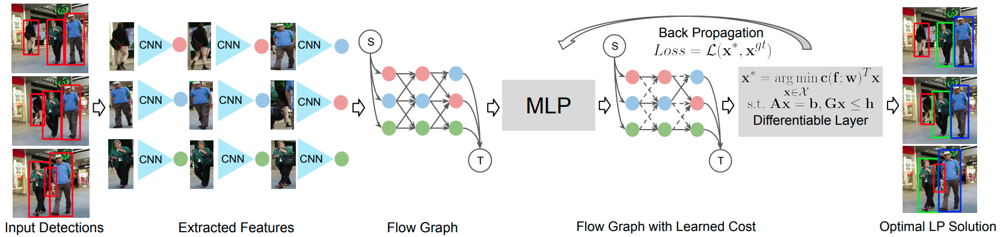

# LPT



Official implementation of the CVPR2022 paper "Learning of Global Objective for Network Flow in Multi-Object Tracking"

## To run the code successfully
- **Gurobi Python:**
Please make sure to install Gurobi Python interface first. 
To check whether the install is successful or not, Do following python code

```shell script
import gurobipy as gp
gurobi_solver = gp.Model()
```

If the installation is successful, there will be no warnings/errors.

- **ReID:**
Please install torchreid, it can be downloaded from: [\[torchreid\]](https://github.com/KaiyangZhou/deep-person-reid). and put it inside ./lib folder.

## Data
Download pre-processed detections&appearance features (~1.4GB): [\[Google Drive\]](https://drive.google.com/file/d/1aJBJcBcD9YNvFvLVb_ECP2W8mYBzPpoI/view?usp=sharing)
We aslo provide the tracking results on MOT17/20 test set, in txt format, which can replicate the numbers reported in the paper.

## Train the model
Execute run_train.ipynb. Monitor all relevant metrics, using our provided data, the loss converges at around 8 epochs. Training with more data might be helpful, but not tested.

## Inference
Execute run_test.ipynb, you need to adjust the MOT17/20 data path accordingly. For one specific MOT20 sequence, running time could be long. 

If you have any questions using this code, please open an issue. I'll respond ASAP.

## Citing
If you find this code useful in your research, please consider citing:
```bibtex
@inproceedings{li2022learning,
  title={Learning of Global Objective for Network Flow in Multi-Object Tracking},
  author={Li, Shuai and Kong, Yu and Rezatofighi, Hamid},
  booktitle={Proceedings of the IEEE/CVF Conference on Computer Vision and Pattern Recognition},
  pages={8855--8865},
  year={2022}
}
